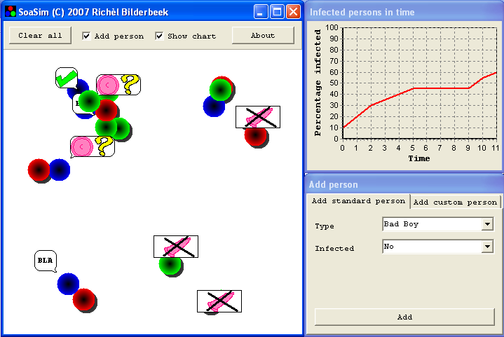

# SoaSim

Branch|
---|---
`master`|

Educational simulation of STD dynamics using the C++ VCL library

 * [Download the Windows executable](http://richelbilderbeek.nl/ToolSoaSimExe.zip)
 * Video's: [YouTube](https://youtu.be/nNvr51psO_0) [.ogv](http://richelbilderbeek.nl/sim_immune_response.ogv)
 * Download the Dutch teaching material: [doc](TeachSoaSim.doc) [odt](TeachSoaSim.odt) [pdf](TeachSoaSim.pdf)

